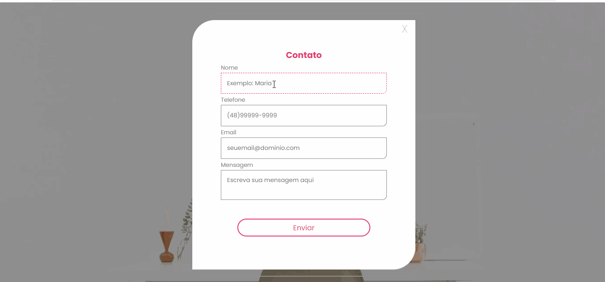

<h1 align="center">Contact Form</h1>

### :mag: Sobre o projeto 

Uma página web responsiva de um formulário de contato. Conta com a validação dos campos verificando se estão preenchidos e caso negativo existem animações e costumizações que servem de aviso ao usuário. Projeto criado para composição de portfólio e consolidação de aprendizado.

### 🛠️ Tecnologias 

* HTML
* CSS
* JavaScript

### :key: Executar a aplicação

Clone este repositório
$ git clone https://github.com/raissaboeng/contact-form.git

Acesse a pasta do projeto em seu computador e execute o arquivo index.html no navegador.

Com 💜 por Raissa Boeng

